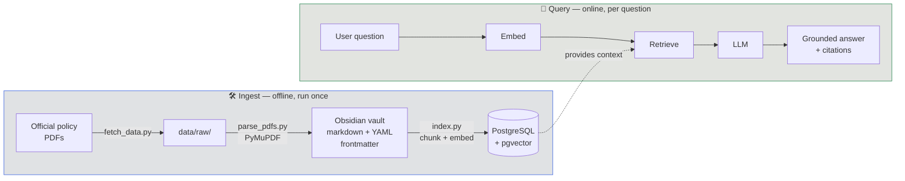

<div align="center">

# ✈️ flight-refund-rag

**A retrieval-augmented generation system that answers flight-cancellation refund
questions — grounded in real airline and government policy, with every answer cited.**

Air Canada · WestJet · Canada APPR · US DOT

<br>


</div>

---

## Why this project

Anyone can wire an LLM to a vector database. The interesting engineering question
is **how much retrieval quality actually matters** — so this repo ships **four
progressively smarter retrievers** and measures each against a hand-authored
golden set. The headline isn't "a refund chatbot," it's a reproducible,
apples-to-apples comparison of naive vector search → hybrid → reranked →
metadata-filtered retrieval.

> [!NOTE]
> **Runs with zero API keys and zero accounts.** PostgreSQL/pgvector and the LLM
> (Ollama `llama3.2:3b`) both run locally in Docker. Clone → `docker compose up`
> → one ingest command → working system. Set `ANTHROPIC_API_KEY` to optionally
> upgrade generation to Claude.

## Architecture



- **Embeddings** — local `BAAI/bge-small-en-v1.5` (384-dim, deterministic, no key).
- **Vector store** — PostgreSQL + pgvector (`vector` column type, `<=>` cosine distance).
- **Corpus** — an [Obsidian](https://obsidian.md) vault of markdown policy notes.
  YAML frontmatter (`airline`, `jurisdiction`, `doc_type`, `topic`, …) becomes
  searchable metadata on every chunk.
- **Generation** — Ollama `llama3.2:3b` by default; Claude if a key is set.

## The four retrievers

| Tag | Retriever | Technique | What it adds |
|-----|-----------|-----------|--------------|
| `v1-naive`    | Vector similarity   | Fixed-size chunks + cosine search               | Baseline |
| `v2-hybrid`   | Hybrid              | BM25 + vector, fused via reciprocal rank fusion | Keyword + semantic recall |
| `v3-reranked` | Hybrid + rerank     | v2 + cross-encoder reranking                    | Precision at the top |
| `v4-metadata` | Metadata-filtered   | Self-query filtering on frontmatter             | Scoped, structured retrieval |

Each version is a git tag. Evaluation compares them on the same golden set.

### Results

> [!NOTE]
> **Preliminary — golden set is n=20 answerable questions (+5 unanswerable),
> growing toward ~50.** Treat as directional. RAGAS answer-quality metrics and
> the generator comparison are in progress.

**Retrieval quality** (20 answerable questions; local Docker, CPU):

| Retriever | recall@5 | MRR | hit-rate | latency/query |
|-----------|:--------:|:---:|:--------:|:-------------:|
| `v1-naive` (vector)              | 0.67 | 0.65 | 0.80 | **0.08s** |
| `v2-hybrid` (BM25 + vector, RRF) | 0.60 | 0.61 | 0.70 | 0.09s |
| `v3-reranked` (vector-20 → cross-encoder-5) | **0.69** | **0.83** | **0.90** | 7.95s |
| `v4-metadata` (LLM filter → filtered vector) | 0.43 | 0.42 | 0.50 | 1.06s |

**Bottom line:** `v3-reranked` wins on quality (at ~100× the latency); `v1-naive`
is the best speed/quality trade-off; `v2` and `v4` each *hurt* — instructive
failures, explained below.

**recall@5 by question category** (n=5 each):

| Category | `v1-naive` | `v2-hybrid` | `v3-reranked` | `v4-metadata` |
|----------|:----------:|:-----------:|:-------------:|:-------------:|
| airline-specific    | 1.00 | 1.00 | 1.00 | 1.00 |
| simple-lookup       | 0.70 | 0.50 | 0.70 | 0.40 |
| casual-vs-legalese  | 0.50 | 0.50 | 0.50 | **0.00** |
| multi-hop           | 0.47 | 0.40 | **0.57** | 0.30 |

### Findings so far

1. **Right retrieval, wrong reasoning (the headline).** `v1` retrieves the
   correct source (e.g. 14 CFR §260.6, which *guarantees* a cash refund for a
   cancelled flight) but the 3B model sometimes **contradicts its own citation**
   ("you cannot get a cash refund"). Failure localizes to *generation*, not
   retrieval — which is why the next experiment holds the retriever constant and
   swaps the generator (llama3.2:3b → Claude) to measure how much of the error
   budget is small-model synthesis.

2. **Hybrid made retrieval *worse* here — and sample size mattered.** At n=9,
   `v2-hybrid` looked like a tie with `v1`; at n=20 it's clearly behind
   (recall@5 0.67 → 0.60). BM25's lexical signal added ranking noise to
   already-strong embeddings — worst on `simple-lookup` (0.70 → 0.50) — while the
   real failures are *semantic* (casual wording vs. legalese), which lexical
   matching can't bridge. Lesson: measure per corpus, and beware conclusions
   drawn from a handful of questions.

3. **Reranking is the quality winner — and it costs latency.** `v3`'s
   cross-encoder lifts **MRR 0.65 → 0.83** and **hit-rate 0.80 → 0.90** by
   reordering candidates so the right chunk lands in the top 5 — it even rescued
   a question `v1` missed entirely (a casual "pushed my flight a day later"
   query, 0.00 → rank #1). But recall@5 only nudged (0.67 → 0.69), because
   reranking can only reorder the top-20 the vector step *already* retrieved — if
   the right chunk isn't in that pool, it stays lost. The price: **~0.08s → ~8s
   per query** (~100× on CPU). Precision buys latency — a real production
   trade-off, and the argument for a GPU or a lighter reranker if latency matters.

4. **Metadata self-query backfired — the 3B model *over-filters*.** `v4` asks the
   local model to extract a metadata filter (e.g. `airline = WestJet`) before
   searching. The model's *format* was reliable — **95%** valid JSON, **100%**
   correct airline when one was actually named — but it applied airline filters
   to questions that shouldn't have them (e.g. *"the airline pushed my flight a
   day later"* → `airline = Air Canada`), which then **excluded the US DOT
   regulation notes that held the answer.** Result: airline-specific stayed
   perfect (1.00) but everything else cratered — casual-vs-legalese went to
   **0.00** and overall recall@5 fell to **0.43**, the worst of the four. The
   lesson isn't "3B models can't do structured output" — it's that self-query
   needs judgment about *when* to filter, not just *how*, and a small model
   guesses a filter wherever a phrase like "the airline" appears.

5. **Refusal works — mostly.** On the 5 "unanswerable" questions (deliberately
   outside the corpus), the grounded prompt made `llama3.2:3b` decline **4/5
   (80%)** with "I don't know based on the available policies." The one miss
   answered a credit-card-insurance question with a bare "No." — an *ungrounded*
   overreach. So the refusal instruction meaningfully curbs hallucination but
   isn't a guarantee with a 3B model — another data point for the generator-axis
   experiment.

### Takeaways

- **Retrieval was rarely the bottleneck on this corpus.** Plain vector search
  (`v1`) already hit recall@5 0.67; the larger error sources were *generation*
  (a 3B model contradicting its own citation) and *filter judgment* (`v4`
  over-filtering). On a small, semantically clean corpus, `bge` embeddings are
  hard to beat with lexical tricks.
- **Two of four "upgrades" made things worse** — and being able to explain *why*
  (hybrid adds lexical noise; self-query over-filters) is the point. Retrieval
  techniques are corpus-dependent, not universally better.
- **The real skill is the trade-off calls:** reranking buys accuracy for ~100×
  latency; metadata filtering helps only when the query is genuinely scoped;
  hybrid helps only when failures are lexical. Measurement made each call explicit.
- **Next:** isolate generation from retrieval by swapping `llama3.2:3b` for a
  frontier model on the best retriever — the hypothesis is that most remaining
  error is *synthesis*, not *search*.

_Reproduce:_ `python -m eval.retrieval_metrics --retriever v1-naive` (swap in
`v2-hybrid`, `v3-reranked`, `v4-metadata`) · refusal: `python -m eval.refusal_test`
· 3B filter reliability: `python -m src.retrievers.v4_metadata --report`.

## Technologies

| Area | Choice | Why |
|------|--------|-----|
| Orchestration | **LangChain** | Standard RAG building blocks; swappable retrievers |
| Vector store | **PostgreSQL + pgvector** | SQL-native, production-realistic, one `<=>` operator |
| Embeddings | **sentence-transformers** (`bge-small-en-v1.5`) | Local, deterministic, no API key |
| Generation | **Ollama** (`llama3.2:3b`), optional **Claude** | Runs offline by default |
| PDF parsing | **PyMuPDF** | Fast, layout-aware text extraction |
| Corpus format | **Obsidian vault** (markdown + YAML) | Human-inspectable, git-diffable, metadata-rich |
| Evaluation | Custom **recall@5 / MRR** + refusal harness (RAGAS planned) | Retriever-agnostic, reproducible |
| Infra | **Docker Compose** | One command, reproducible local stack |

## Project structure

```
flight-refund-rag/
├── vault/
│   ├── regulations/           # APPR, US DOT 14 CFR notes (committed)
│   └── airlines/              # Air Canada, WestJet notes (gitignored, reproduced locally)
├── data/raw/                  # source PDFs/XML — gitignored, reproduced via fetch_data.py
├── src/
│   ├── config.py              # env-driven config (DATABASE_URL, models, chunking)
│   ├── ingest/
│   │   ├── fetch_data.py      # download corpus from official URLs → data/raw/
│   │   ├── parse_pdfs.py      # PDF/XML → markdown vault notes with frontmatter
│   │   └── index.py           # ObsidianLoader → chunk → embed → pgvector
│   └── retrievers/
│       ├── v1_naive.py        # vector similarity  (+ --chat)
│       ├── v2_hybrid.py       # BM25 + vector, RRF
│       ├── v3_reranked.py     # cross-encoder reranking
│       └── v4_metadata.py     # LLM metadata filtering  (+ --report)
├── eval/
│   ├── golden_set.jsonl       # hand-authored Q&A (25; 20 answerable + 5 unanswerable)
│   ├── retrieval_metrics.py   # recall@5 + MRR, retriever-agnostic
│   └── refusal_test.py        # hallucination-refusal rate on unanswerable Qs
├── app.py                     # Gradio web chat UI
├── docker-compose.yml         # postgres + pgvector, ollama
├── requirements.txt
└── .env.example               # config template (no secrets)
```

## Quickstart

Requires **Docker** and **Python 3.12**. Runs with **zero API keys** — Postgres,
pgvector, and the LLM (Ollama) all run locally.

```bash
# 0. Python env
python -m venv .venv && source .venv/bin/activate   # Windows: .venv\Scripts\activate
pip install -r requirements.txt

# 1. Start local infrastructure (Postgres + pgvector, Ollama)
docker compose up -d
docker compose exec ollama ollama pull llama3.2:3b   # one-time, ~2GB

# 2. Build the corpus and index it
python -m src.ingest.fetch_data      # download official docs → data/raw/ (gitignored)
python -m src.ingest.parse_pdfs      # PDF/XML → vault/ markdown notes
python -m src.ingest.index           # chunk → embed → pgvector

# 3. Ask a question — one-shot, interactive chat, or the web UI
python -m src.retrievers.v1_naive "Can I get a refund if my flight was cancelled?"
python -m src.retrievers.v1_naive --chat
python app.py                        # Gradio UI at http://localhost:7860

# 4. Reproduce the evaluation
python -m eval.retrieval_metrics --retriever v1-naive   # or v2-hybrid / v3-reranked / v4-metadata
python -m eval.refusal_test
```

> [!TIP]
> Point at a hosted Postgres (e.g. [Neon](https://neon.tech)) by setting
> `DATABASE_URL` in a local `.env` — the code normalizes the driver and adds
> connection-pool pre-ping for serverless databases. Local Docker stays the default.

## Disclaimer

- **Educational portfolio project.** Not affiliated with, endorsed by, or
  sponsored by any airline, government, or regulator.
- **Not legal advice.** Nothing here is legal advice. For your situation,
  consult the airline, the relevant regulator, or a qualified professional.
- **Policies change.** The corpus reflects source documents as retrieved on the
  dates recorded in each note's `retrieved_date` frontmatter. Rules may have
  changed since — always verify current rules with the airline or regulator.
- **AI-generated answers may be wrong.** Responses are produced by a language
  model over retrieved excerpts and may be inaccurate or incomplete. (The
  evaluation suite includes refusal tests precisely because of this.)
- **No redistribution of airline documents.** Airline contracts of carriage are
  **not** committed to this repo; `src/ingest/fetch_data.py` downloads them
  locally from official URLs for personal, educational use. Only
  government-sourced notes, code, and templates are committed.

## License

The **code** in this repository is licensed under the [MIT License](LICENSE).

Government regulatory text under `vault/regulations/` is reproduced under its own terms:
- **US — 14 CFR Parts 259 & 260** (eCFR): a U.S. Government work, in the **public domain**.
- **Canada — APPR (SOR/2019-150)** (Justice Laws): reproduced under the
  **Reproduction of Federal Law Order**. This is **not an official version** —
  the official version is on the
  [Justice Laws website](https://laws-lois.justice.gc.ca/eng/regulations/SOR-2019-150/).
  Text was reproduced as of the `retrieved_date` recorded in each note.

<div align="center">
<sub>Built as a learning project and portfolio piece.</sub>
</div>
