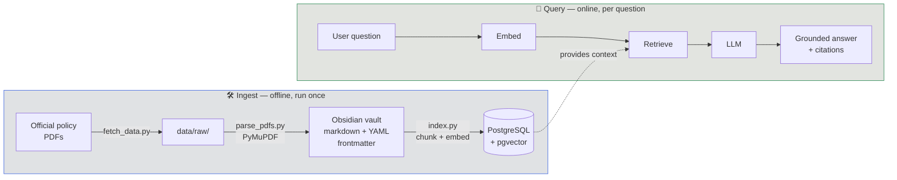

<div align="center">

# ✈️ flight-refund-rag

**A retrieval-augmented generation system that answers flight-cancellation refund
questions — grounded in real airline and government policy, with every answer cited.**

Air Canada · WestJet · Canada APPR · US DOT

<br>


</div>

---

## Why this project

Anyone can wire an LLM to a vector database. The interesting engineering question
is **how much retrieval quality actually matters** — so this repo ships **four
progressively smarter retrievers** and measures each against a hand-authored
golden set. The headline isn't "a refund chatbot," it's a reproducible,
apples-to-apples comparison of naive vector search → hybrid → reranked →
metadata-filtered retrieval.

> [!NOTE]
> **Runs with zero API keys and zero accounts.** PostgreSQL/pgvector and the LLM
> (Ollama `llama3.2:3b`) both run locally in Docker. Clone → `docker compose up`
> → one ingest command → working system. Set `ANTHROPIC_API_KEY` to optionally
> upgrade generation to Claude.

## Architecture



- **Embeddings** — local `BAAI/bge-small-en-v1.5` (384-dim, deterministic, no key).
- **Vector store** — PostgreSQL + pgvector (`vector` column type, `<=>` cosine distance).
- **Corpus** — an [Obsidian](https://obsidian.md) vault of markdown policy notes.
  YAML frontmatter (`airline`, `jurisdiction`, `doc_type`, `topic`, …) becomes
  searchable metadata on every chunk.
- **Generation** — Ollama `llama3.2:3b` by default; Claude if a key is set.

## The four retrievers

| Tag | Retriever | Technique | What it adds |
|-----|-----------|-----------|--------------|
| `v1-naive`    | Vector similarity   | Fixed-size chunks + cosine search               | Baseline |
| `v2-hybrid`   | Hybrid              | BM25 + vector, fused via reciprocal rank fusion | Keyword + semantic recall |
| `v3-reranked` | Hybrid + rerank     | v2 + cross-encoder reranking                    | Precision at the top |
| `v4-metadata` | Metadata-filtered   | Self-query filtering on frontmatter             | Scoped, structured retrieval |

Each version is a git tag. Evaluation compares them on the same golden set.

### Results

_Coming soon — recall@5, MRR, and RAGAS faithfulness/answer-relevancy per version._

## Technologies

| Area | Choice | Why |
|------|--------|-----|
| Orchestration | **LangChain** | Standard RAG building blocks; swappable retrievers |
| Vector store | **PostgreSQL + pgvector** | SQL-native, production-realistic, one `<=>` operator |
| Embeddings | **sentence-transformers** (`bge-small-en-v1.5`) | Local, deterministic, no API key |
| Generation | **Ollama** (`llama3.2:3b`), optional **Claude** | Runs offline by default |
| PDF parsing | **PyMuPDF** | Fast, layout-aware text extraction |
| Corpus format | **Obsidian vault** (markdown + YAML) | Human-inspectable, git-diffable, metadata-rich |
| Evaluation | **RAGAS** + custom recall@5 / MRR (via `pytest`) | LLM-judged + retrieval metrics |
| Infra | **Docker Compose** | One command, reproducible local stack |

## Project structure

```
flight-refund-rag/
├── vault/                 # Obsidian vault — policy notes w/ YAML frontmatter (committed)
├── data/raw/              # source PDFs — gitignored, reproduced via fetch_data.py
├── src/
│   ├── ingest/
│   │   ├── fetch_data.py  # download corpus PDFs from official URLs
│   │   ├── parse_pdfs.py  # PDF → markdown vault notes with frontmatter
│   │   └── index.py       # ObsidianLoader → chunk → embed → pgvector
│   └── retrievers/        # v1..v4 retriever implementations
├── eval/
│   └── golden_set.jsonl   # ~50 hand-authored Q&A pairs (incl. ~5 unanswerable)
├── notebooks/             # exploration
├── docker-compose.yml     # postgres + pgvector, ollama
├── requirements.txt
└── .env.example           # config template (no secrets)
```

## Quickstart

> [!WARNING]
> 🚧 Under active construction — commands below are being wired up as the
> ingest pipeline and `v1-naive` retriever land. This section will be verified
> end-to-end before the first release tag.

```bash
# 1. Start local infrastructure (Postgres + pgvector, Ollama)
docker compose up -d
docker compose exec ollama ollama pull llama3.2:3b   # one-time, ~2GB

# 2. Build the corpus and index it
python -m src.ingest.fetch_data     # download policy PDFs → data/raw/
python -m src.ingest.parse_pdfs     # PDF → vault/ markdown notes
python -m src.ingest.index          # embed + load into pgvector

# 3. Ask a question (v1-naive)
python -m src.retrievers.v1_naive "Can I get a refund if my flight was cancelled?"
```

## Data & licensing

Source policy PDFs are **not** committed to this repository. `src/ingest/fetch_data.py`
downloads them from official sources for local, personal, educational use. All
policies remain the property of their respective airlines and governments.

<div align="center">
<sub>Built as a learning project and portfolio piece.</sub>
</div>
